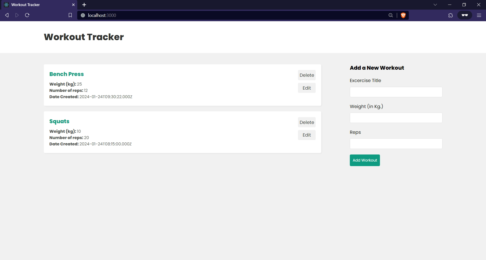
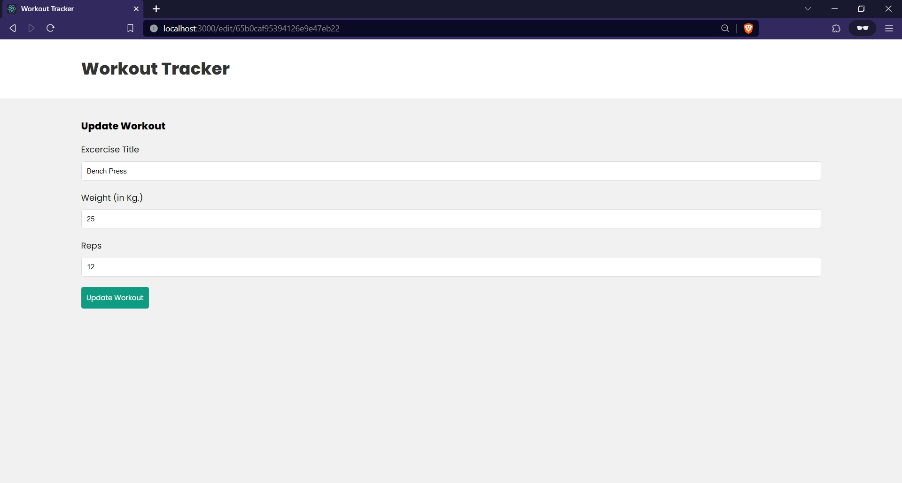

## Setting Up Environment Variables

1. In the `Backend` folder, create an `.env` file with the following content:

    ```env
    # backend/.env

    PORT=<backend-port>
    MONGODB_URI=<database-connection-string>
    ```

2. In the `Frontend` folder, create an `.env` file with the following content:

    ```env
    # frontend/.env

    REACT_APP_BACKEND_URL=<backend-url>
    ```

## Running the Application

1. In the `Backend` folder, run the following commands:

    ```bash
    node server.js
    ```
    
2. In the `Frontend` folder, run the following commands:

    ```bash
    npm start
    ```

---
<details>
<summary><b>Screenshot</b></summary>
<br>

</details>
